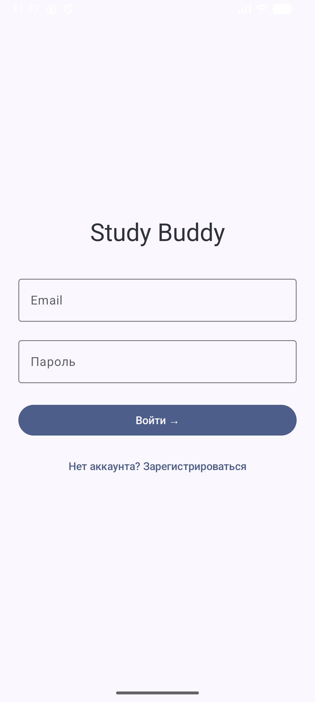
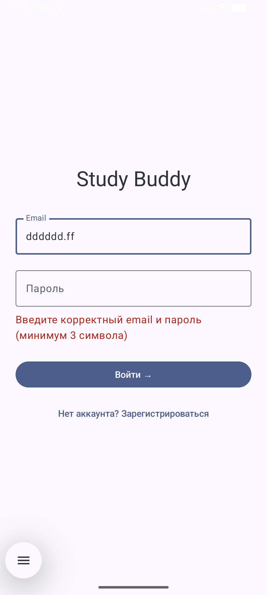
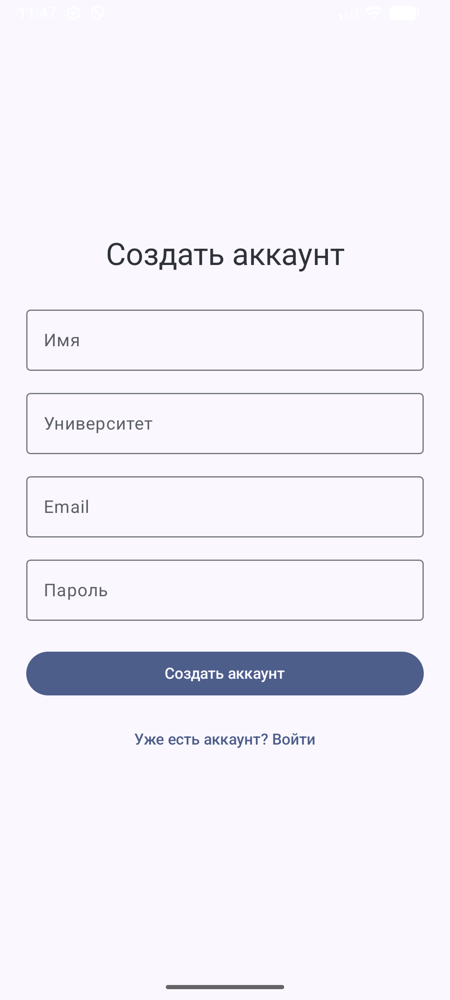
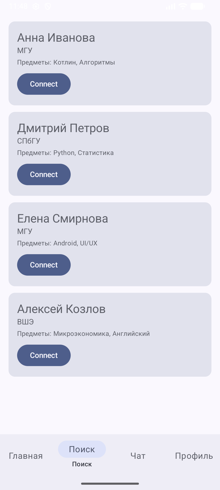
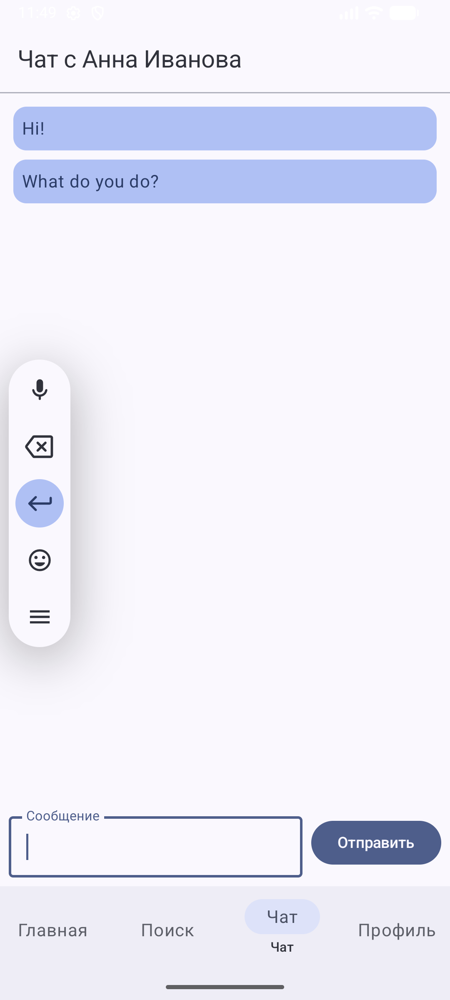
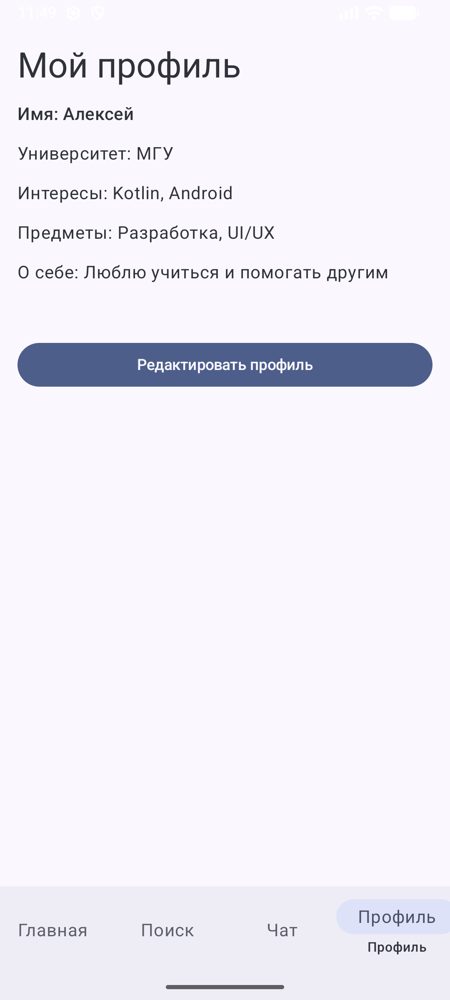
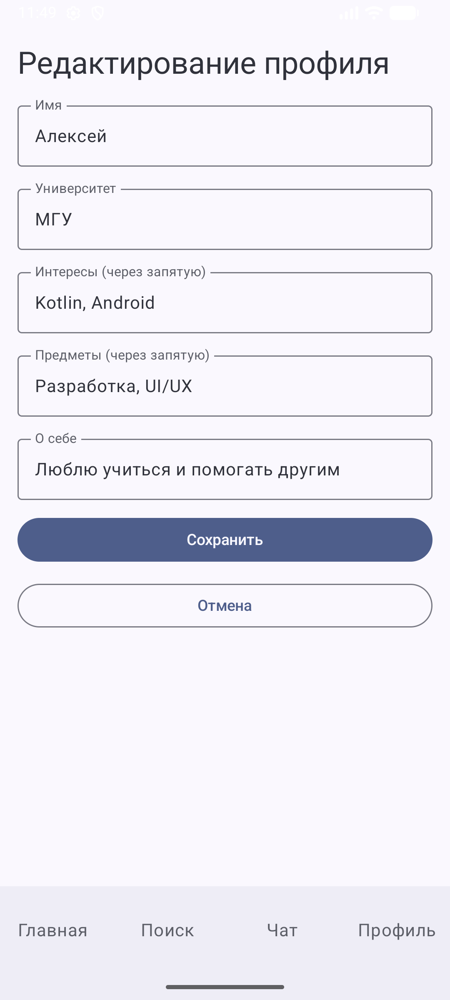

# Study Buddy Match

## Задача заказчика
Мобильное приложение для поиска учебных партнёров среди студентов. Пользователи могут создавать профиль, указывать университет, интересы и предметы, находить подходящих партнёров, обмениваться сообщениями.

## Стек
- **Язык**: Kotlin
- **UI**: Jetpack Compose
- **Навигация**: Navigation Compose
- **Хранилище**: в памяти (mock-данные)
- **Минимальный API**: 24

## Установка и запуск
1. Клонируйте репозиторий: `git clone <ссылка>`
2. Откройте проект в Android Studio
3. Дождитесь синхронизации Gradle
4. Запустите приложение на эмуляторе (Pixel 6/7 с API 33) или устройстве

## Скриншоты

| Экран входа | Ошибка входа | Регистрация |
|-------------|--------------|--------------|
|  |  |  |

| Список партнёров | Профиль партнёра | Чат |
|------------------|------------------|-----|
|  |  |  |

| Профиль пользователя | Редактирование профиля |
|----------------------|------------------------|
|  |  |

## Тестирование

Проведено ручное тестирование 10 сценариев:

| № | Сценарий | Шаги | Ожидаемый результат | Статус |
|---|----------|------|---------------------|--------|
| 1 | Успешный вход | Ввести email с '@' (test@mail.ru), пароль (123), нажать «Войти» | Переход на главный экран | ✅ |
| 2 | Ошибка входа | Ввести email без '@', пароль из 2 символов, нажать «Войти» | Красное сообщение об ошибке | ✅ |
| 3 | Успешная регистрация | Заполнить все поля (имя, универ, email с '@', пароль ≥3), нажать «Создать аккаунт» | Переход на главный экран | ✅ |
| 4 | Ошибка регистрации | Оставить поле "Имя" пустым, заполнить остальное, нажать «Создать аккаунт» | Красное сообщение об ошибке | ✅ |
| 5 | Открытие списка партнёров | Нажать иконку «Поиск» на нижней панели | Отображение 4 карточек пользователей | ✅ |
| 6 | Просмотр профиля партнёра | Нажать на карточку пользователя | Открывается детальная информация и кнопка «Отправить запрос» | ✅ |
| 7 | Отправка запроса (переход в чат) | В профиле партнёра нажать «Отправить запрос» | Переход в экран чата с этим партнёром | ✅ |
| 8 | Отправка и отображение сообщений | Написать текст в чате, нажать «Отправить» | Сообщение отображается, поле очищается | ✅ |
| 9 | Редактирование профиля | В профиле нажать «Редактировать», изменить данные, сохранить | Данные обновляются в профиле | ✅ |
| 10 | Отмена редактирования | В редактировании изменить поля, нажать «Отмена» | Возврат в профиль без сохранения | ✅ |

## Структура проекта